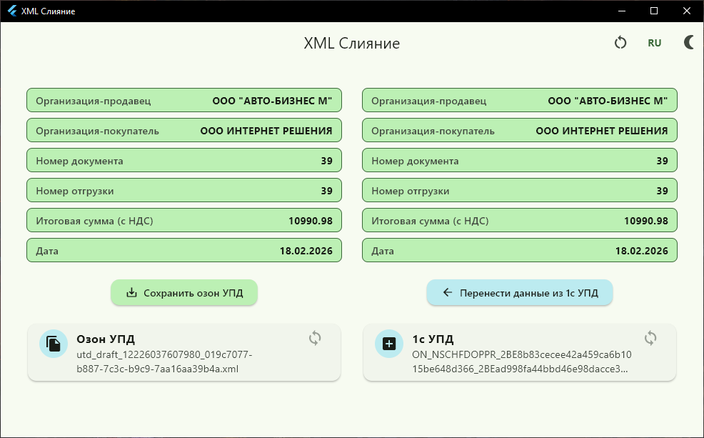
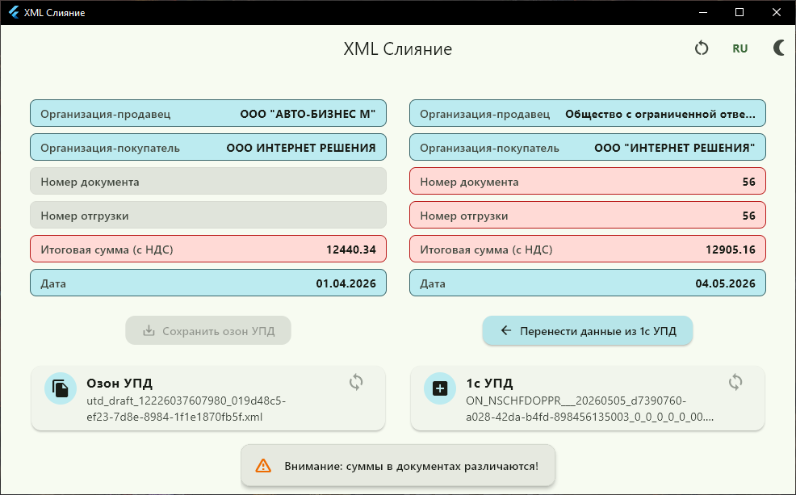
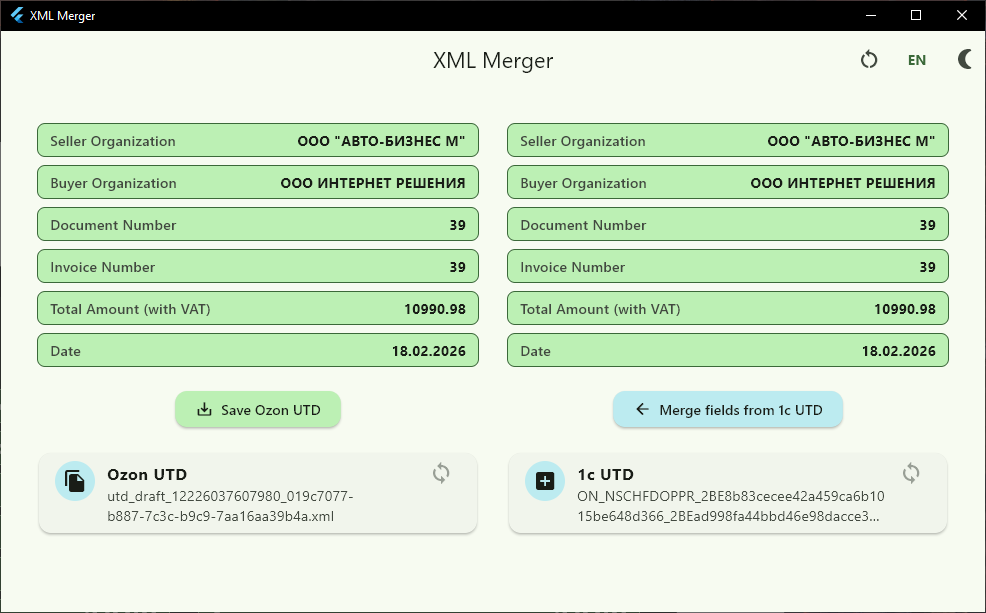
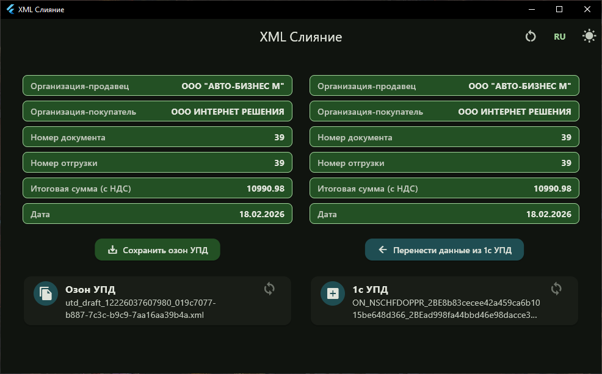
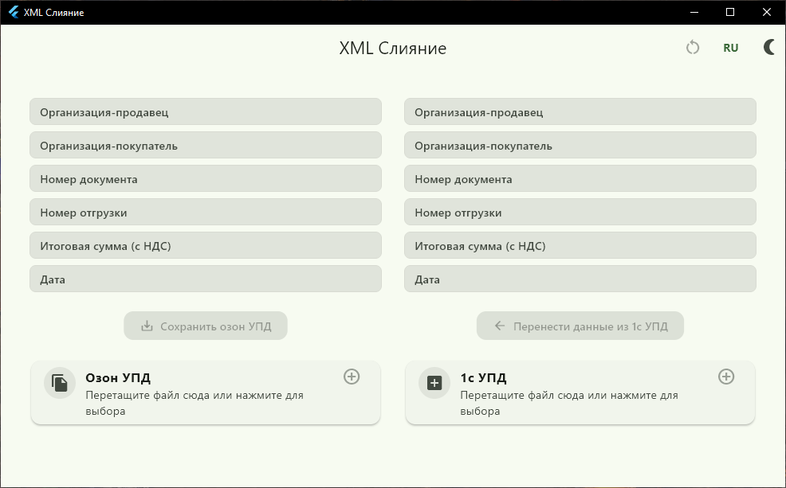

# XML Merger (1C to Ozon UPD)

Удобное десктопное приложение для автоматического обогащения и подготовки XML-документов УПД (
Универсальный Передаточный Документ) под требования маркетплейса Ozon.

## Суть проекта

Приложение решает проблему рутинного заполнения документов при отгрузках на Ozon. Оно автоматически
берет XML-выгрузку из 1С, находит недостающие обязательные поля и переносит их в целевой XML-файл
для Ozon.

## ⚡ Основные функции

* **Умное слияние данных:** Автоматически находит и переносит нужные реквизиты.
* **Загрузка в один клик (Drag-and-Drop):** Добавляйте XML-файлы простым перетаскиванием мыши в окно
  приложения.
* **Интуитивный интерфейс:** Интерактивные карточки визуально подсказывают статус загрузки каждого
  файла.
* **Кастомизация UI:** Поддержка Темной и Светлой тем оформления для комфортной работы в любое время
  суток.
* **Два языка:** Полная поддержка Русского и Английского интерфейсов.
* **Сохранение настроек:** Приложение запоминает выбранный язык и тему при следующем запуске.

## Скриншоты интерфейса

### Успешное выполнение

### Уведомления системы

### Английский интерфейс

### Темная тема

### Стартовы экран

